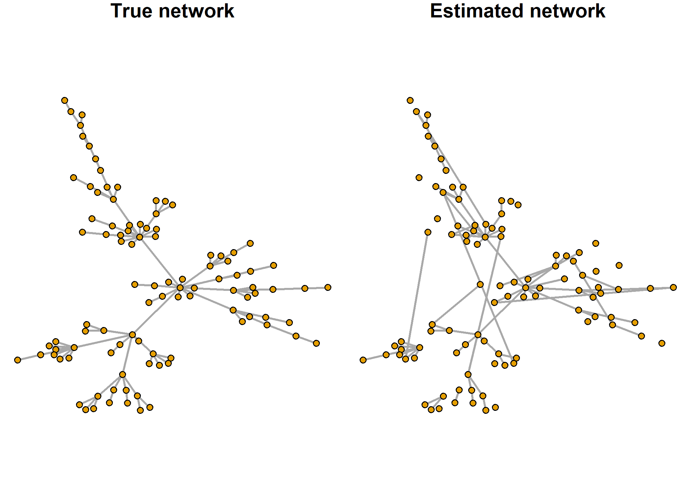

# GHSGEM: Generalized expectation-maximization (GEM) algorithm with graphical horseshoe (GHS) prior for network estimation

This R package implements a generalized expectation-maximization
algorithm with a graphical horseshoe prior for network estimation and
covariance and precision (inverse of the covariance) matrices
estimation.

## Installation

The GHSGEM package can be installed using the following code:

``` r
if(!require("devtools", quietly = TRUE)) {
  install.packages("devtools")
}
devtools::install_github("THautamaki/GHSGEM")
```

## Example of usage

This is a minimum working example.

``` r
# Install R package huge if not yet installed.
if(!require("huge", quietly = TRUE)) {
  install.packages("huge")
}

library(GHSGEM)
library(huge)

n <- 200  # number of observations (sample size)
p <- 100  # number of variables
```

Generate simulated data using huge.generator.

``` r
set.seed(20250303)
sim <- huge.generator(n = n, d = p, graph = "scale-free")
```

Run GHS GEM algorithm.

``` r
map <- GHS_MAP_estimation(sim$data, verbose = 0)
```

    ## Total iterations: 74. Elapsed time: 1.08245 s. Final difference: 9.97717e-05

Calculate and print confusion matrix.

``` r
(cm <- conf_matrix(sim$theta, map$Theta_est))
```

    ##        Estim. P Estim. N
    ## True P       71       28
    ## True N       13     4838

Calculate and print some performace scores.

``` r
round(calculate_scores(cm)[, c("MCC", "F1", "TPR", "FDR")], 4)
```

    ##      MCC    F1    TPR    FDR
    ## 1 0.7745 0.776 0.7172 0.1548

Plot the true simulated network and estimated network using R package
`igraph`.

``` r
if(!require("igraph", quietly = TRUE)) {
  install.packages("igraph")
}
library(igraph)
```

Generate graph objects using `graph_from_adjacency_matrix` function from
`igraph` package.

``` r
true_network <- graph_from_adjacency_matrix(sim$theta, mode = "undirected", diag = F)
est_network <- graph_from_adjacency_matrix(map$Theta_est, mode = "undirected", diag = F)
```

Create coordinates for nodes of the network.

``` r
set.seed(10)
coords <- layout_with_fr(true_network)
```

Finally, plot both true and estimated networks.

``` r
par(mfrow = c(1,2), mar = c(0.1, 0.1, 1, 0.1))
plot(true_network, layout = coords, vertex.label.color = "black", edge.width = 2,
     vertex.size = 4, vertex.label = NA, main = "True network")
plot(est_network, layout = coords, vertex.label.color = "black", edge.width = 2,
     vertex.size = 4, vertex.label = NA, main = "Estimated network")
```


